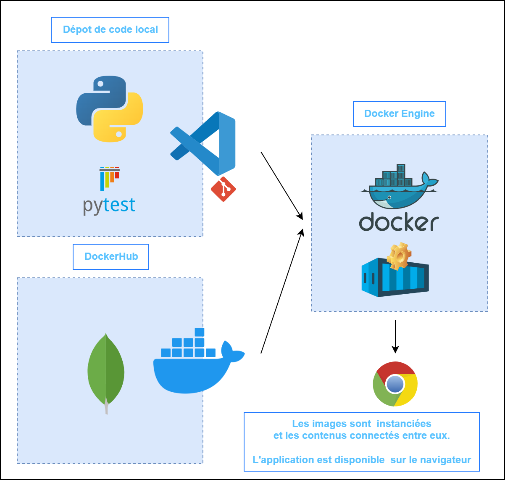

<head>
  <link rel="stylesheet" href="https://maxcdn.bootstrapcdn.com/font-awesome/4.5.0/css/font-awesome.min.css">
</head>

# Docker-Compose

 <!-- .element width="35%" align="left"-->
 <!-- .element width="19%" align="right" -->

---

## Introduction

----

### Définition de Docker Compose

- Outil qui permet de définir et de gérer des applications Docker multi-conteneurs à l'aide d'un fichier YAML appelé docker-compose.yml.

- Simplifie le processus de déploiement en permettant de décrire les services, les réseaux et les volumes nécessaires à une application dans un seul fichier.

----

### Son rôle dans la gestion des applications Docker multi-conteneurs

- Facilite le déploiement d'applications composées de plusieurs conteneurs en automatisant les tâches telles que la création, le démarrage, l'arrêt et la suppression des conteneurs.

- Permet également de spécifier les relations et les dépendances entre les différents services, ce qui simplifie la configuration et la gestion de l'ensemble de l'application.

---

## Structure de base

----

### Syntaxe de base

- Le fichier docker-compose.yml utilise une syntaxe `YAML` simple pour définir les services, les réseaux et les volumes nécessaires à l'application.

----

### Principales sections : services, networks, volumes

Le fichier docker-compose.yml est généralement divisé en trois sections principales :

- **Services** : définit les différents conteneurs qui composent l'application, ainsi que les paramètres spécifiques à chaque service.
- **Networks** : spécifie les réseaux sur lesquels les conteneurs peuvent communiquer.
- **Volumes** : déclare les volumes Docker pour le stockage persistant des données.

----

- Chaque service est défini avec ses propres paramètres tels que l'image Docker à utiliser, les ports à exposer, les volumes à monter, etc.

- Les réseaux et les volumes sont également déclarés avec leurs configurations respectives.

---

## Fonctionnement

----

### Création et gestion des conteneurs

- Utilise les configurations spécifiées dans le fichier docker-compose.yml pour créer et gérer les conteneurs nécessaires à l'application.

- Lance les conteneurs en fonction des définitions de services, en les reliant automatiquement si nécessaire.

----

### Communication entre les services

- Les services déclarés dans Docker Compose peuvent communiquer entre eux via des noms de service plutôt que des adresses IP, ce qui simplifie la configuration et la maintenance de l'application.

----

### Gestion des dépendances et des liens entre les conteneurs

- Docker Compose gère automatiquement les dépendances et les liens entre les différents services déclarés, en veillant à ce que les services requis soient disponibles avant de démarrer un service dépendant.

----

### Configuration de l'environnement

- Permet de spécifier des variables d'environnement pour les services, ce qui facilite la configuration de l'application en fonction de l'environnement de déploiement (développement, test, production, etc.).

---

## Avantages

----

### Simplification du déploiement d'applications multi-conteneurs

- Simplifie considérablement le processus de déploiement en automatisant la création, la configuration et la gestion des conteneurs nécessaires à l'application.

----

### Gestion centralisée des configurations

- En regroupant toutes les configurations dans un seul fichier docker-compose.yml, Docker Compose permet une gestion centralisée et cohérente de l'ensemble de l'application.

----

### Facilité de mise à l'échelle et de réplication des services

- Facilite la mise à l'échelle et la réplication des services en permettant de spécifier facilement le nombre de réplicas pour chaque service, ainsi que les configurations de mise à l'échelle automatique.

---

## TD - création du Docker-Compose

[par ici](./demo/04.1_DevOps_TD_Docker-Compose.md)

---

 <!-- .element width="65%" -->

---

## Bonnes pratiques

----

### Organisation claire et modulaire du fichier docker-compose.yml

- Il est recommandé d'organiser le fichier `docker-compose.yml` de manière claire et modulaire, en regroupant les services similaires et en utilisant des références externes si nécessaire pour simplifier la configuration.

----

### Utilisation de variables d'environnement pour la configuration

- L'utilisation de variables d'environnement dans le fichier `docker-compose.yml` permet de rendre la configuration de l'application plus flexible et portable entre différents environnements.

----

### Surveillance et journalisation des services

- Il est important de surveiller et de journaliser les services déployés à l'aide de Docker Compose pour détecter et résoudre rapidement les problèmes éventuels.

---

## En résumé

- Docker Compose simplifie considérablement le déploiement d'applications Docker multi-conteneurs en regroupant la configuration dans un fichier unique.

- Offre une solution efficace pour automatiser la création, le démarrage et la gestion des conteneurs, tout en favorisant une gestion centralisée et une mise à l'échelle aisée des services.

----

- Grâce à son approche modulaire et à l'utilisation de variables d'environnement, Docker Compose simplifie la gestion des environnements de développement et de déploiement, tout en assurant une cohérence et une fiabilité accrues des applications Docker.

---

## La suite

[Github Actions](05_DevOps_Github_Actions.md)

 <!-- .element width="25%" -->
