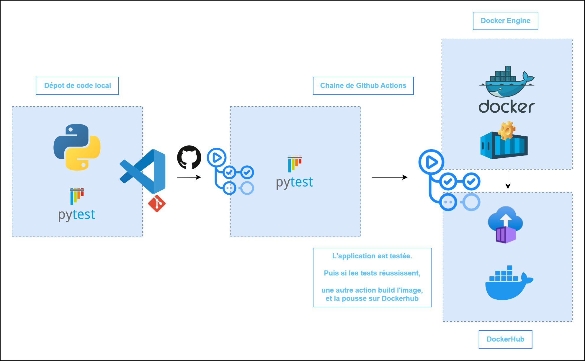

<head>
  <link rel="stylesheet" href="https://maxcdn.bootstrapcdn.com/font-awesome/4.5.0/css/font-awesome.min.css">
</head>

# GitHub Actions

 <!-- .element width="25%" align="left"-->
 <!-- .element width="19%" align="right" -->

---

## Introduction

----

### Définition de GitHub Actions

- Service d'automatisation intégré directement dans GitHub, permettant d'automatiser diverses tâches de développement, de test et de déploiement directement à partir de votre référentiel GitHub.

----

### Objectifs et avantages

- Conçues pour simplifier et automatiser les workflows de développement logiciel.

- Leur intégration directe avec GitHub offre plusieurs avantages, notamment une automatisation transparente, une intégration continue (CI) et un déploiement continu (CD) faciles, ainsi qu'une grande flexibilité pour créer des workflows personnalisés.

---

## Structure de base

----

### Workflow YAML

- Un workflow GitHub est défini dans un fichier YAML situé dans le répertoire `.github/workflows` de votre dépôt.

- Ce fichier spécifie les actions à exécuter, les déclencheurs pour démarrer le workflow et d'autres configurations.

----

### Événements déclencheurs (triggers)

- Les GitHub Actions sont déclenchées par des événements tels que les pushs de code, les pull requests, les créations de branches, les labels, etc.

- Vous pouvez définir des workflows spécifiques pour réagir à ces événements.

----

### Jobs et étapes (Steps)

- Un workflow GitHub est composé de un ou plusieurs `jobs`, qui sont des séquences d'étapes (`steps`).

- Chaque `steps` représente une action à exécuter, comme la construction de code, les tests unitaires, le déploiement, etc.

- Les étapes peuvent être exécutées en parallèle ou en séquence, selon les besoins du workflow.

---

## Fonctionnement

----

### Déclenchement des actions

- Les actions GitHub sont déclenchées automatiquement en réponse à des événements spécifiques définis dans le workflow.

- Par exemple, un push de code vers une branche déclenchera un workflow de construction et de test.

----

### Exécution des workflows

- Une fois déclenchées, les GitHub Actions exécutent les workflows en fonction des configurations spécifiées dans le fichier YAML.

- Chaque étape est exécutée dans un environnement d'exécution isolé, ce qui garantit la cohérence et la reproductibilité des résultats.

----

### Gestion des résultats

- À la fin de l'exécution, les GitHub Actions fournissent des informations détaillées sur le résultat de chaque étape du workflow.

- Vous pouvez consulter les journaux d'exécution pour identifier les erreurs et les problèmes éventuels.

---

## Personnalisation et configuration avancée

- Les GitHub Actions offrent de nombreuses options de personnalisation et de configuration avancée, telles que la définition de variables d'environnement, l'utilisation de conditionnels, l'intégration avec des outils externes, etc.

---

## Intégration avec les workflows de développement

----

### Intégration continue (CI)

- GitHub Actions peut être utilisée pour mettre en œuvre des pipelines d'intégration continue (CI), automatisant ainsi les processus de construction, de test et de validation de code à chaque modification du référentiel.

----

### Déploiement automatique (CD)

- Elles peuvent également être utilisées pour mettre en œuvre des pipelines de déploiement continu (CD), permettant ainsi d'automatiser le déploiement et la mise à jour d'applications sur divers environnements, tels que les environnements de test, de pré-production et de production.

----

### Automatisation des tâches récurrentes

- Les GitHub Actions peuvent automatiser une grande variété de tâches récurrentes, telles que la génération de documentation, la notification des développeurs, la mise à jour des versions, la gestion des tickets, etc.

---

## TD - création de nos Github Actions

[par ici](./demo/05.1_DevOps_TD_Github_Actions.md)

---

---

## Bonnes pratiques

----

### Organisation et modularité des workflows

- Il est recommandé d'organiser les workflows en modules réutilisables et de les maintenir séparément pour faciliter la gestion et la maintenance à long terme.

----

### Gestion des secrets et des variables d'environnement

- Il est important de gérer les secrets et les informations sensibles de manière sécurisée en utilisant les fonctionnalités intégrées de gestion des secrets et des variables d'environnement dans GitHub Actions.

----

### Tests et validation des workflows

- Il est crucial de tester et de valider les workflows GitHub Actions régulièrement pour garantir leur bon fonctionnement et leur efficacité, en particulier lorsque des modifications sont apportées au code ou aux configurations.

---

## En résumé

- Les GitHub Actions offrent une solution puissante et flexible pour automatiser les workflows de développement, d'intégration continue et de déploiement continu, directement à partir de votre dépôt GitHub.

---

## La suite

[Manifest Kubernetes](06_DevOps_Manifest_K8S.md)

 <!-- .element width="30%" -->
