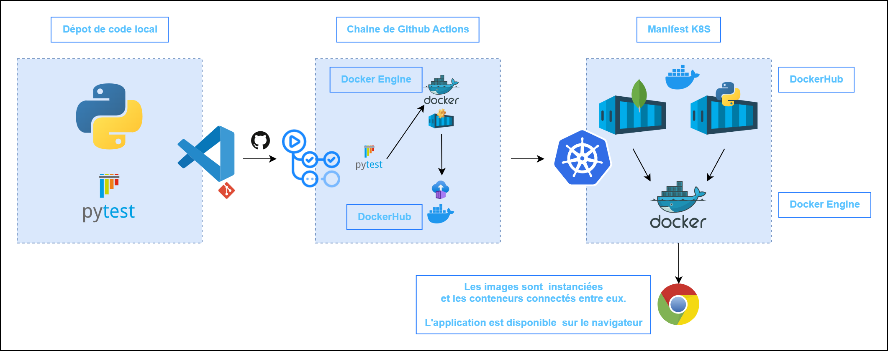
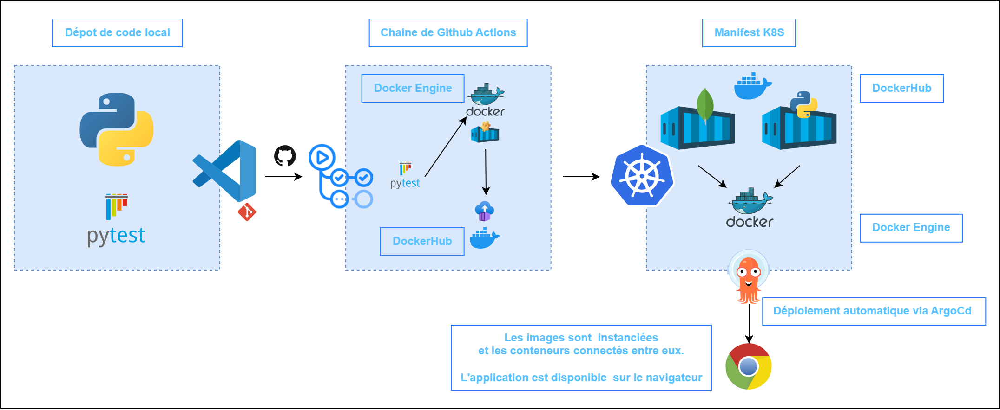

<head>
  <link rel="stylesheet" href="https://maxcdn.bootstrapcdn.com/font-awesome/4.5.0/css/font-awesome.min.css">
</head>

# Manifest Kubernetes

 <!-- .element width="30%" align="left"-->
 <!-- .element width="19%" align="right" -->

---

## Introduction

----

### Définir un manifest Kubernetes

- Fichier YAML utilisé pour définir et déclarer les ressources nécessaires à une application ou à un service sur une plateforme Kubernetes.

- Contient des informations telles que le type de ressource, les métadonnées et les spécifications de configuration nécessaires pour déployer et gérer les applications sur Kubernetes.

----

### Rôle dans la définition et la gestion des ressources Kubernetes

- Joue un rôle essentiel dans la définition et la gestion des ressources Kubernetes.

- Permet de décrire de manière détaillée les caractéristiques et les exigences des ressources, facilitant ainsi le déploiement, la mise à jour et la surveillance des applications dans un environnement Kubernetes.

---

## Structure

----

### Syntaxe YAML

- Ils sont écrits en `YAML` (**YAML Ain't Markup Language**), un format de sérialisation de données simple et lisible par l'homme.

- La syntaxe `YAML` utilise une structure basée sur l'indentation pour organiser les données.

----

### Principales sections : metadata, spec

Un manifest Kubernetes est généralement composé de deux principales sections :

- **Metadata** : Contient des métadonnées sur la ressource, telles que le nom, l'étiquette (label), et d'autres informations qui aident à identifier et à gérer la ressource.

- **Spec** : Définit les spécifications de configuration de la ressource, telles que les conteneurs, les volumes, les services, etc.

----

### Ressources couramment définies

Ils peuvent définir une variété de ressources:

- Namespaces
- Services
- Déploiements (Deployments)
- StatefulSet
- PersistentVolumeClaims (PVCs)
- ConfigMaps
- Secrets
- Et d'autres ressources Kubernetes selon les besoins de l'application.

----

### Namespaces

- Espaces de travail virtuels permetant de diviser un cluster en unités logiques plus petites.

- Utilisés pour organiser et isoler les ressources au sein d'un cluster.

- **EX:** différentes équipes ou environnements peuvent avoir leurs propres namespaces pour éviter les conflits de noms et garantir une isolation des ressources.

----

### Services

- Permettent de définir un point d'entrée stable pour accéder à un ensemble de pods qui exécutent une application.

- Permettent de faire abstraction de la complexité de la gestion des adresses IP et des ports des pods, en fournissant une seule adresse IP et un seul port pour accéder à l'application.

- Peuvent être de type `ClusterIP`, `NodePort` ou `LoadBalancer`, en fonction des besoins d'exposition de l'application.

----

### Déploiements (Deployments)

- Permettent de déclarer et de gérer de manière déclarative des applications dans un cluster.

- Fournissent un moyen de définir l'état souhaité de l'application, en spécifiant le nombre de réplicas (instances) à exécuter et les stratégies de mise à jour et de roulement des versions.

- Facilitent la mise à l'échelle, la mise à jour et le rollback des applications de manière transparente.

----

### StatefulSet

- Contrôleurs Kubernetes utilisés pour déployer et gérer des applications étatiques, telles que les BDD, les caches et les applications nécessitant un stockage persistant.

- Contrairement aux `déploiements`, les `StatefulSets` garantissent un ordre spécifique de création, de mise à jour et de suppression des pods, ainsi qu'une stabilité des identifiants réseau et du stockage persistant pour chaque pod.

----

### PersistentVolumeClaims (PVCs)

- Ressources utilisées pour demander un ***espace de stockage persistant*** dans un cluster.

- Permettent aux applications de demander un stockage persistant sans avoir à connaître les détails de mise en œuvre du stockage sous-jacent.

- Peuvent être liés à des volumes persistants prédéfinis ou dynamiquement provisionnés à partir d'un stockage disponible dans le cluster.

----

### ConfigMaps

- Ressources utilisées pour stocker des données de configuration sous forme de ***paires/clé-valeur***.

- Permettent de séparer la configuration de l'application de son code source, ce qui facilite la gestion et la mise à jour de la configuration sans avoir à reconstruire l'image de l'application.

- Peuvent être montés en tant que volumes dans les conteneurs ou utilisés comme variables d'environnement dans les pods.

----

### Secrets

- Ressources utilisées pour stocker des données sensibles, telles que des clés d'API, des mots de passe et des certificats, de manière sécurisée.

- Permettent de séparer les données sensibles du code source de l'application et de les gérer de manière sécurisée dans un environnement Kubernetes.

- Les Secrets peuvent être montés en tant que volumes dans les conteneurs ou utilisés comme variables d'environnement dans les pods.

---

## Fonctionnement

----

### Création et déploiement des ressources

- Une fois que le manifest Kubernetes est écrit, il peut être appliqué à un cluster Kubernetes à l'aide de l'outil en ligne de commande `kubectl apply`.

- Cela déclenche la création des ressources spécifiées dans le manifest et leur déploiement sur le cluster.

----

### Mise à jour et gestion des ressources

- Les manifestes Kubernetes peuvent être mis à jour pour refléter les changements dans les besoins de l'application.

- Les mises à jour peuvent inclure des modifications de configuration, des mises à niveau de version, des changements d'échelle, etc.

- Ces mises à jour peuvent être appliquées à l'aide de `kubectl apply`, qui gère automatiquement les changements nécessaires sur le cluster.

----

### Surveillance et maintenance des ressources

- Une fois déployées, les ressources Kubernetes spécifiées dans le manifest peuvent être surveillées et gérées à l'aide de divers outils de surveillance et de gestion, tels que les tableaux de bord Kubernetes, les outils de journalisation et de suivi des performances, etc.

- Ces outils permettent de garantir que les ressources fonctionnent correctement et de détecter rapidement et de résoudre tout problème éventuel.

----

### Comparatif

| Caractéristique | Docker Compose | Kubernetes |
|:------ |:------ |:------ |
| Orchestration de conteneurs | ✔️ | ✔️ |
| Définition déclarative  | ✔️ | ✔️ |
| Évolutivité | ✔️ | ✔️ |

Notes:
**Orchestration de conteneurs :**
Docker Compose et Kubernetes sont tous deux des outils utilisés pour orchestrer des conteneurs.

**Définition déclarative :**
Les deux permettent de définir l'état désiré du système dans un fichier de configuration déclaratif.

**Évolutivité :**
Ils peuvent tous deux gérer des applications à grande échelle en répartissant les charges de travail sur plusieurs hôtes.

----

| Caractéristique | Docker Compose | Kubernetes |
|:------ |:------ |:------ |
| Gestion des réseaux  | ✔️ | ✔️ |
| Isolation des ressources  | ✔️ | ✔️ |
| Portée de l'orchestration | 1 seule machine | 1 cluster de machines |

Notes:
**Gestion des réseaux :**
Docker Compose et Kubernetes offrent des fonctionnalités pour la gestion des réseaux, permettant aux conteneurs de communiquer entre eux.

**Isolation des ressources :**
Les deux fournissent une isolation des ressources, garantissant que les applications s'exécutent de manière indépendante les unes des autres.

**Portée de l'orchestration :**
Docker Compose est principalement utilisé pour orchestrer des conteneurs sur une seule machine, tandis que Kubernetes est conçu pour orchestrer des conteneurs sur un cluster de machines.

----

| Caractéristique | Docker Compose | Kubernetes |
|:------ |:------ |:------ |
| Extensibilité | ➖ | ➕ |
| haute disponibilité  | ➖ | ➕ |
| mises à jour | basique  | avancée |
| Complexité  | ➖ | ➕ |

Notes:
**Extensibilité :**
Kubernetes est plus extensible que Docker Compose, avec une large gamme de plugins et de ressources personnalisables pour répondre à des cas d'utilisation variés.

**Gestion de la haute disponibilité :**
Kubernetes est plus adapté à la gestion de la haute disponibilité avec ses fonctionnalités avancées telles que la réplication automatique des pods et la détection des pannes.

**Gestion des mises à jour :**
Kubernetes propose des fonctionnalités avancées pour la gestion des mises à jour d'applications, telles que le déploiement progressif et le rollback automatique en cas d'échec.

**Complexité :**
Docker Compose est généralement plus simple à configurer et à utiliser pour les déploiements simples, tandis que Kubernetes peut être plus complexe en raison de sa nature plus polyvalente et de ses fonctionnalités avancées.

---

## TD - Manifest K8S

[par ici](./demo/06.1_DevOps_TD_Manifest_K8S.md)

---

---

## Bonnes pratiques

----

### Modularité et réutilisabilité des manifestes

- Il est recommandé d'adopter une approche modulaire dans la rédaction des manifestes Kubernetes, en les découpant en plusieurs fichiers réutilisables pour faciliter la gestion et la maintenance.

----

### Utilisation de labels et de sélecteurs pour la gestion des ressources

- L'utilisation de labels et de sélecteurs dans les manifestes Kubernetes permet de regrouper, d'organiser et de gérer les ressources de manière efficace, en facilitant la gestion des dépendances et des relations entre les ressources.

----

### Gestion de la configuration et des secrets

- Il est important de gérer la configuration sensible, tels que les mots de passe et les clés d'API, de manière sécurisée en utilisant des ressources telles que les ConfigMaps et les Secrets dans les manifestes Kubernetes, et en adoptant des bonnes pratiques de sécurité pour protéger ces informations sensibles.

---

## En résumé

- Les manifestes Kubernetes jouent un rôle crucial dans le déploiement et la gestion des applications sur Kubernetes, et leur compréhension et leur maîtrise sont essentielles pour les opérations de développement et d'exploitation sur Kubernetes.

---

## prochain Objectif

---

## La suite

### ARGOCD

  <!-- .element width="35%" -->
