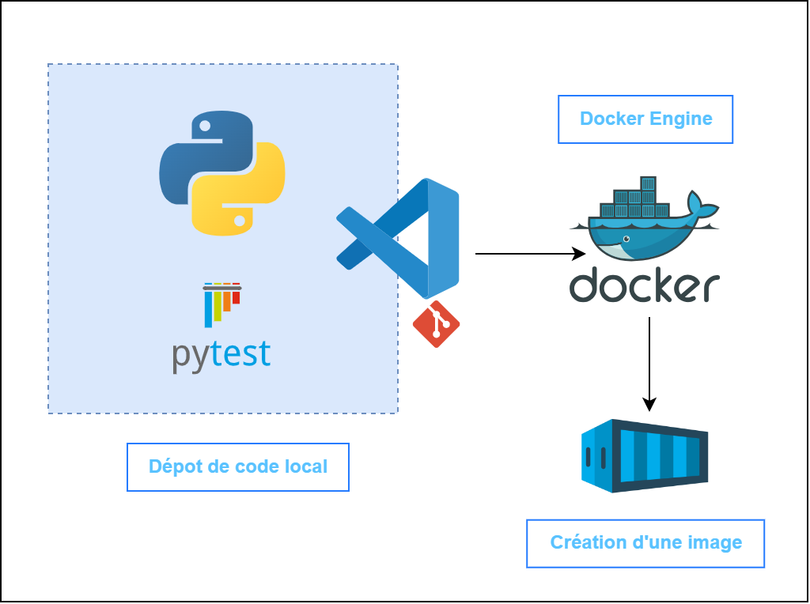

<head>
  <link rel="stylesheet" href="https://maxcdn.bootstrapcdn.com/font-awesome/4.5.0/css/font-awesome.min.css">
</head>

# Dockerfile

 <!-- .element width="35%" align="left"-->
 <!-- .element width="19%" align="right" -->

---

## Introduction

----

### Définition

- Fichier texte utilisé pour définir les étapes nécessaires à la construction d'une image Docker.

- Contient une série d'instructions qui spécifient les actions à effectuer pour configurer et préparer l'environnement dans lequel une application Dockerisée sera exécutée.

----

### Utilité dans la construction d'images Docker

- Essentiel pour créer des images Docker personnalisées

- Permet de décrire de manière détaillée toutes les dépendances, configurations et commandes nécessaires pour mettre en place un environnement d'exécution spécifique à une application.

---

## Structure de base

----

### Syntaxe minimale

- Un Dockerfile suit une syntaxe simple et comprend une série d'instructions clés pour définir le processus de construction de l'image Docker.

----

### Principales instructions

- Les instructions principales incluent notamment `FROM`, `RUN`, `COPY`, `WORKDIR`, `EXPOSE`, `CMD`, et `ENTRYPOINT`, chacune jouant un rôle spécifique dans la création de l'environnement d'exécution de l'application.

---

## Fonctionnement

----

### Processus de construction de l'image Docker

- Lorsqu'un Dockerfile est utilisé, Docker suit séquentiellement les instructions qu'il contient pour construire une image Docker.

- Chaque instruction crée une couche d'image, formant ainsi une image finale qui peut être utilisée pour exécuter des conteneurs.

----

### Utilisation des couches d'image

- Les couches d'image sont des éléments essentiels du processus de construction de Docker.

- Elles permettent une construction incrémentielle, où chaque instruction dans le Dockerfile ajoute une nouvelle couche à l'image.

- Cela permet une réutilisation efficace des couches déjà construites et contribue à la performance et à l'efficacité de Docker.

----

### Mécanisme de cache pour optimiser la construction

- Docker utilise un mécanisme de cache intelligent pour éviter de reconstruire des parties de l'image qui n'ont pas été modifiées.

- Cela accélère considérablement le processus de construction, en particulier lors du développement itératif.

---

## TD - Création du Dokerfile

[par ici](../../demo/03.1_DevOps_TD_Dockerfile.md)

---

 <!-- .element width="85%" -->

---

## Bonnes pratiques

----

### Organisation claire des instructions

- Il est recommandé de structurer le Dockerfile de manière claire et logique, en regroupant les instructions similaires et en les commentant si nécessaire pour faciliter la compréhension et la maintenance.

----

### Minimisation de la taille des images

- Il est important de veiller à ce que l'image Docker résultante soit aussi petite que possible, en supprimant les dépendances inutiles et en optimisant les étapes de construction pour réduire la taille finale de l'image.

----

### Utilisation efficace du cache

- Pour maximiser les performances, il est essentiel d'utiliser efficacement le mécanisme de cache de Docker en plaçant les instructions les moins sujettes au changement en amont du Dockerfile.

---

## En résumé

----

### Importance de comprendre Dockerfile dans l'écosystème Docker

La compréhension de Dockerfile est essentielle pour quiconque souhaite créer, personnaliser et déployer des applications avec Docker. En maîtrisant Dockerfile, les développeurs peuvent créer des environnements d'exécution cohérents, reproductibles et optimisés pour leurs applications.

---

## La suite

[docker-compose](04_DevOps_Docker-Compose.md)

 <!-- .element width="35%" -->
