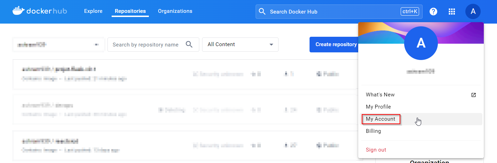
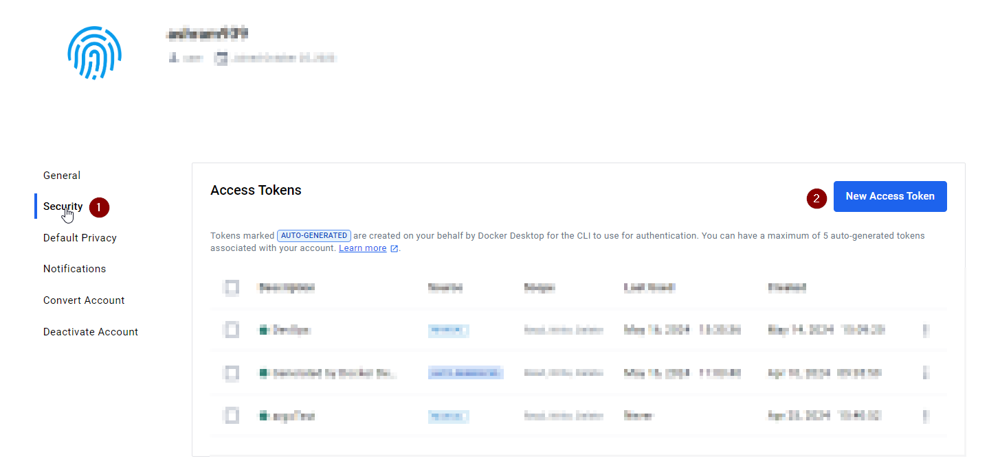
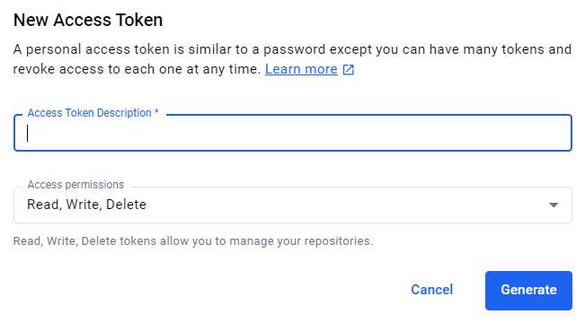
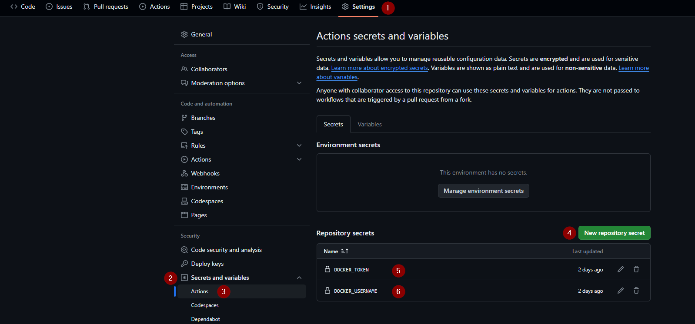

# TD - création des Github Actions

----

## 1 - Architecture d'accueil

A la racine de votre projet créez un répertoire :

`.github`

puis à l'intérieur de ce dernier un autre répertoire :

`workflows`

```UML
DevOps/
  └── .github/
  │  └── workflows/
  └── App/
  │  │
  │  ├── app.py
  │  ├── routes/
  │  │   └── main_routes.py
  │  └── templates/
  │  │   └── index.html
  │  └── tests/
  │  │   └── test_email_validation.py
  │  └── requirement.txt
  │  └── Dockerfile
  └── db/
  │    └── init.js
  └── docker-compose.yaml
```

----

## 2 - Action de gestion d'éxecution des tests

Dans le répertoire `workflows` créer un fichier: `docker-tests.yml`

```UML
DevOps/
  └── .github/
  │  └── workflows/
  │      └── docker-tests.yml
  └── App/
  │  │
  │  ├── app.py
  │  ├── routes/
  │  │   └── main_routes.py
  │  └── templates/
  │  │   └── index.html
  │  └── tests/
  │  │   └── test_email_validation.py
  │  └── requirement.txt
  │  └── Dockerfile
  └── db/
  │    └── init.js
  └── docker-compose.yaml
```

----

Contenu du `docker-tests.yml`

```YAML
name: Docker Tests  # Nom du workflow GitHub Actions

on:  # Déclencheurs du workflow, dans ce cas, un push sur la branche "main"
  push:
    branches: [ "main" ]

jobs:  # Définition des tâches à exécuter dans le workflow

  pytest:  # Nom de la tâche, dans ce cas, exécution des tests Pytest
    runs-on: ubuntu-latest  # Système d'exploitation sur lequel les tâches seront exécutées

    steps:  # Étapes à exécuter dans la tâche

    - name: Checkout du code  # Étape de récupération du code source
      uses: actions/checkout@v3  # Utilisation de l'action "checkout" pour récupérer le code du dépôt

    - name: Installation des dépendances  # Étape d'installation des dépendances Python
      run: |  # Commandes à exécuter dans l'étape, utilisant un script multi-lignes
        python -m pip install --upgrade pip  # Mise à jour de pip
        pip install -r ./App/requirements.txt  # Installation des dépendances spécifiées dans le fichier requirements.txt

    - name: Exécution des tests Pytest  # Étape d'exécution des tests Pytest
      run: |  # Commandes à exécuter dans l'étape, utilisant un script multi-lignes
        pytest  # Commande pour lancer les tests Pytest
```

----

### Syntaxe commentée

----

1. `name: Docker Tests`

   - Il s'agit de la première ligne du fichier YAML et définit le nom du workflow GitHub Actions. Cette clé (`name`) est suivie de la valeur associée (`Docker Tests`).

----

2. `on:`

   - Cette section définit les déclencheurs pour le workflow. Dans ce cas, le workflow est déclenché lorsqu'un push est effectué sur la branche "main".

----

3. `push:`

   - Cette sous-section indique que le workflow est déclenché lorsqu'un push est effectué sur le dépôt.

----

4. `branches: [ "main" ]`

   - Cette sous-section spécifie les branches sur lesquelles le déclencheur doit être actif. Dans ce cas, le workflow est déclenché uniquement pour les pushs sur la branche "main".

----

5. `jobs:`

   - Cette section définit les différents emplois (ou jobs) à exécuter dans le workflow. Chaque job représente une série d'actions à effectuer.

----

6. `pytest:`
   - Il s'agit du nom du premier job défini dans le workflow. Dans ce cas, il s'agit de l'exécution des tests Pytest.

----

7. `runs-on: ubuntu-latest`

   - Cette ligne spécifie l'environnement d'exécution pour le job. Dans ce cas, le job est exécuté sur une machine Ubuntu.

----

8. `steps:`

   - Cette section définit les étapes à exécuter dans le job. Chaque étape est une action spécifique à effectuer.

----

9. `- name: Checkout du code`

   - Il s'agit du nom de la première étape. Dans ce cas, il s'agit de récupérer le code source du dépôt.

----

10. `uses: actions/checkout@v3`

    - Cette étape utilise l'action "checkout" fournie par GitHub Actions pour récupérer le code source du dépôt. La version spécifiée est la version 3 (`v3`) de l'action.

----

11. `- name: Installation des dépendances`

    - Il s'agit du nom de la deuxième étape, qui consiste à installer les dépendances Python nécessaires pour exécuter les tests.

----

12. `run: |`

    - Cette ligne indique que les commandes suivantes seront exécutées dans un bloc multi-lignes.

----

13. `python -m pip install --upgrade pip`

    - C'est la première commande à exécuter dans cette étape. Elle met à jour l'outil de gestion de paquets Python, pip.

----

14. `pip install -r ./App/requirements.txt`

    - C'est la deuxième commande à exécuter dans cette étape. Elle installe les dépendances Python spécifiées dans le fichier `requirements.txt` situé dans le répertoire `App`.

----

15. `- name: Exécution des tests Pytest`

    - Il s'agit du nom de la troisième étape, qui consiste à exécuter les tests Pytest.

----

16. `run: |`

    - Cette ligne indique que les commandes suivantes seront exécutées dans un bloc multi-lignes.

----

17. `pytest`

    - C'est la commande à exécuter dans cette étape. Elle lance les tests Pytest pour vérifier le bon fonctionnement de l'application.

---

## 3 - Test

Faites une modification sur un fichier de votre code (ex: `README.md`) et poussez la sur votre repository

Rendez-vous sur votre dépot Github puis dans l'onglet actions

Observez le déroulement des étapes de l'action

---

## 4 - Ajustement des autorisations et utilisation des secrets

Créez-vous un profil sur DockerHub ou connectez-y vous

<https://hub.docker.com/>

### Génération de votre token Dockerhub

- Rendez-vous dans `My Account`



----

- Sélectionnez `Security` puis `New Access Token`



----

- Donnez lui un nom et cliquez sur `Generate`

/!\ Conservez précieusement votre token, il ne sera disponible qu'à sa génération



----

### Créations des secrets Sur votre dépot Github

- Rendez-vous dans les `Settings` de votre dépot Github

- Dans `Secrets and variables` --> `Actions`

- Créez 2 `New repository secret`

```SHELL
DOCKER_USERNAME # contiendra votre username DockerHub
DOCKER_TOKEN # contiendra votre token DockerHub
```



---

## 5 - Action qui build l'application et la push vers Dockerhub

Dans le répertoire `workflows` créer un fichier: `docker-image.yml`

```UML
DevOps/
  └── .github/
  │  └── workflows/
  │      └── docker-image.yml
  │      └── docker-tests.yml
  └── App/
  │  │
  │  ├── app.py
  │  ├── routes/
  │  │   └── main_routes.py
  │  └── templates/
  │  │   └── index.html
  │  └── tests/
  │  │   └── test_email_validation.py
  │  └── requirement.txt
  │  └── Dockerfile
  └── db/
  │    └── init.js
  └── docker-compose.yaml
```

----

Contenu du `docker-image.yml`

```YAML
name: Docker Image CI  # Nom de l'action GitHub

on:  # Événement déclencheur de l'action
  workflow_run:  # Déclenché lorsqu'un workflow spécifique est exécuté
    workflows: [Docker Tests]  # Déclenche uniquement lorsque le workflow "Docker Tests" est exécuté
    types: [completed]  # Déclenche uniquement lorsque le workflow spécifié est terminé

jobs:  # Définition des jobs à exécuter lors de l'événement déclencheur

  on-success:  # Job à exécuter en cas de succès du workflow
    runs-on: ubuntu-latest  # Utilisation de l'image Ubuntu la plus récente pour exécuter le job
    if: ${{ github.event.workflow_run.conclusion == 'success' }}  # Condition pour exécuter le job uniquement en cas de succès du workflow

    steps:  # Étapes à exécuter dans le job
      - uses: actions/checkout@v3  # Récupération du code source du référentiel

      - name: Build the Docker image  # Nom de l'étape pour construire l'image Docker
        run: docker build ./App -t ${{ secrets.DOCKER_USERNAME }}/projet-flask-v0.1:${{ github.sha }}  # Commande pour construire l'image Docker avec des tags spécifiques

      - name: Log in to Docker Registry  # Nom de l'étape pour se connecter au registre Docker
        run: echo "${{ secrets.DOCKER_TOKEN }}" | docker login docker.io -u ${{ secrets.DOCKER_USERNAME }} --password-stdin  # Commande pour se connecter au registre Docker en utilisant les secrets du référentiel

      - name: Push the Docker image  # Nom de l'étape pour pousser l'image Docker vers le registre
        run: docker push ${{ secrets.DOCKER_USERNAME }}/projet-flask-v0.1:${{ github.sha }}  # Commande pour pousser l'image Docker vers le registre en utilisant les secrets du référentiel

  on-failure:  # Job à exécuter en cas d'échec du workflow
    runs-on: ubuntu-latest  # Utilisation de l'image Ubuntu la plus récente pour exécuter le job
    if: ${{ github.event.workflow_run.conclusion == 'failure' }}  # Condition pour exécuter le job uniquement en cas d'échec du workflow
    
    steps:  # Étapes à exécuter dans le job
      - run: echo 'Le workflow ne s'est pas éxécuter car les tests ont échoués'  # Affichage d'un message en cas d'échec des tests
```

----

### Syntaxe commentée

----

1. `name: Docker Image CI`

   - Cette ligne définit le nom de l'action GitHub. Il s'agit simplement d'un libellé descriptif pour l'action.

----

2. `on:`

   - C'est une section qui définit les événements qui déclenchent l'exécution de l'action.

----

3. `workflow_run:`
   - Cet événement est déclenché lorsqu'un workflow spécifique est exécuté.

----

4. `workflows: [Docker Tests]`
   - Il spécifie le nom du workflow qui déclenche cette action. Dans ce cas, l'action est déclenchée uniquement lorsque le workflow "Docker Tests" est exécuté.

----

5. `types: [completed]`
   - Cela spécifie le type d'événement qui déclenche l'action. Ici, l'action est déclenchée uniquement lorsque le workflow spécifié est terminé.

----

6. `jobs:`

   - C'est la section principale où les jobs sont définis. Un job est une séquence d'étapes à exécuter lors de l'exécution de l'action.

----

7. `on-success:`
   - Il s'agit du nom du premier job défini dans cette action. Ce job sera exécuté en cas de succès du workflow.

----

8. `runs-on: ubuntu-latest`
   - Cette ligne spécifie l'environnement dans lequel le job sera exécuté. Ici, le job sera exécuté sur une machine virtuelle Ubuntu.

----

9. `if: ${{ github.event.workflow_run.conclusion == 'success' }}`

   - Cette ligne définit une condition pour exécuter le job. Le job sera exécuté uniquement si la conclusion du workflow est un succès.

----

10. `steps:`

    - C'est la section où les étapes à exécuter dans le job sont définies.

----

11. `- uses: actions/checkout@v3`

    - Cette étape récupère le code source du référentiel.

----

12. `- name: Build the Docker image`

    - C'est le nom de l'étape. Il s'agit simplement d'un libellé descriptif pour l'étape.

----

13. `run: docker build ./App -t ${{ secrets.DOCKER_USERNAME }}/projet-flask-v0.1:${{ github.sha }}`

    - Cette étape exécute une commande pour construire l'image Docker. Elle utilise les secrets du référentiel pour les informations d'identification.

----

14. `- name: Log in to Docker Registry`

    - C'est le nom de l'étape. Il s'agit simplement d'un libellé descriptif pour l'étape.

----

15. `run: echo "${{ secrets.DOCKER_TOKEN }}" | docker login docker.io -u ${{ secrets.DOCKER_USERNAME }} --password-stdin`

    - Cette étape se connecte au registre Docker en utilisant les informations d'identification fournies par les secrets du référentiel.

----

16. `- name: Push the Docker image`

    - C'est le nom de l'étape. Il s'agit simplement d'un libellé descriptif pour l'étape.

----

17. `run: docker push ${{ secrets.DOCKER_USERNAME }}/projet-flask-v0.1:${{ github.sha }}`

    - Cette étape pousse l'image Docker vers le registre Docker en utilisant les secrets du référentiel.

----

18. `on-failure:`

    - Il s'agit du nom du deuxième job défini dans cette action. Ce job sera exécuté en cas d'échec du workflow.

----

19. `runs-on: ubuntu-latest`

    - Cette ligne spécifie l'environnement dans lequel le job sera exécuté. Ici, le job sera exécuté sur une machine virtuelle Ubuntu.

----

20. `if: ${{ github.event.workflow_run.conclusion == 'failure' }}`

    - Cette ligne définit une condition pour exécuter le job. Le job sera exécuté uniquement si la conclusion du workflow est un échec.

----

21. `steps:`

    - C'est la section où les étapes à exécuter dans le job sont définies.

----

22. `- run: echo 'Le workflow ne s'est pas éxécuter car les tests ont échoués'`

    - Cette étape affiche un message en cas d'échec des tests. C'est une simple commande shell qui imprime un message dans la sortie standard.

----

## 6 - Test

Faites une modification sur un fichier de votre code (ex: `README.md`) et poussez la sur votre repository

Rendez-vous sur votre dépot Github puis dans l'onglet actions

Observez le déroulement des étapes des actions
