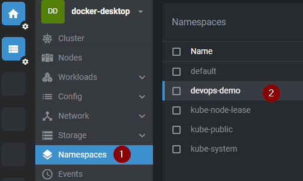
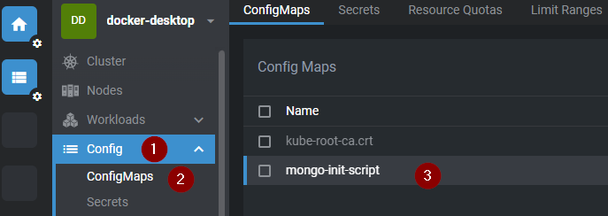
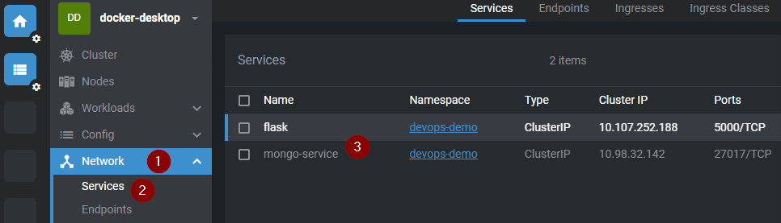
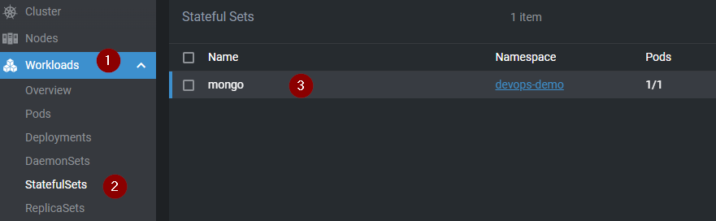
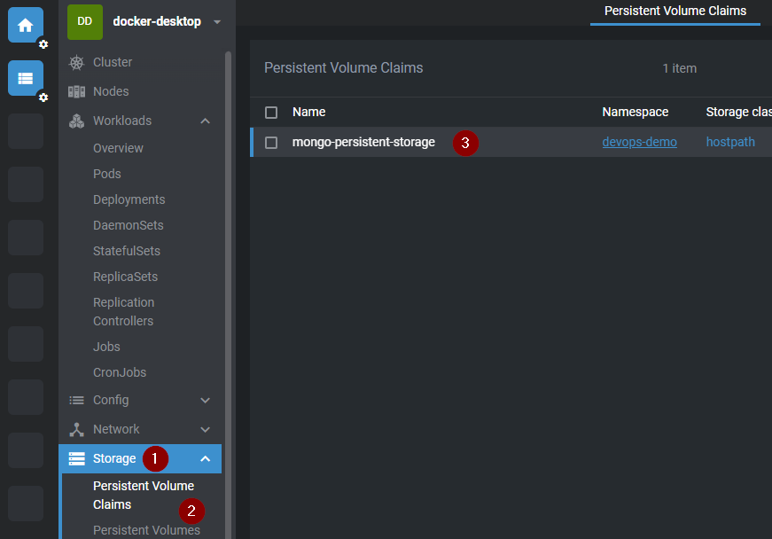
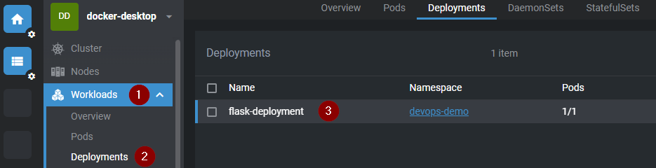
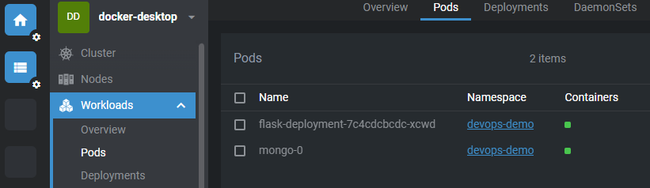
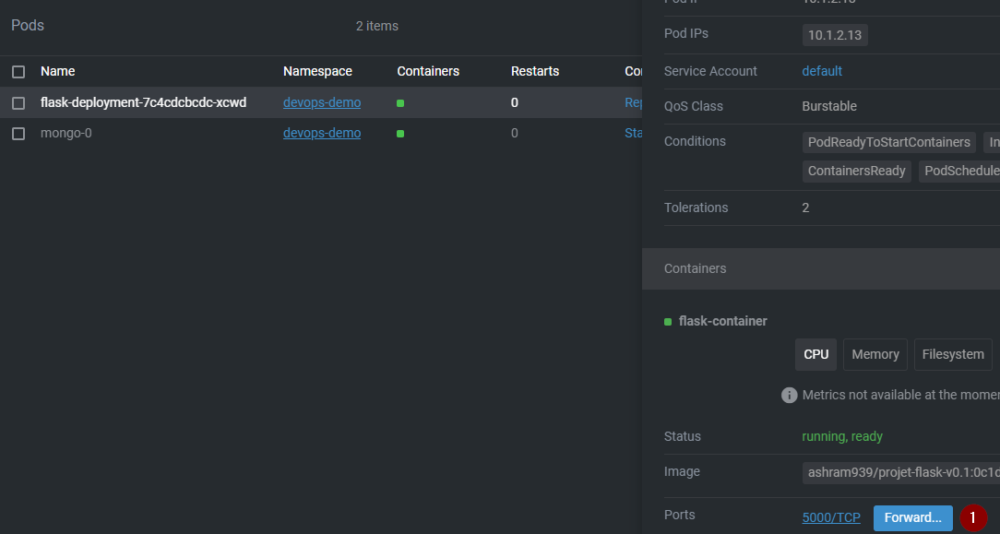
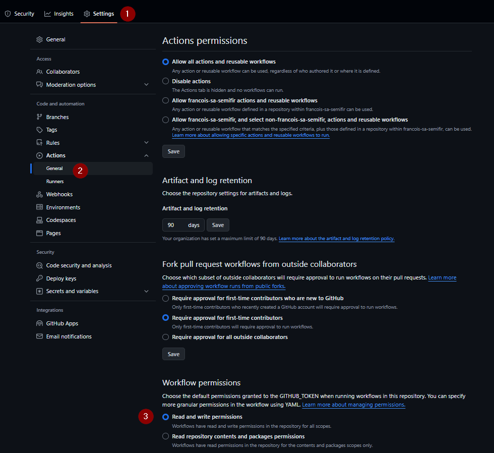

# TD - création des manifests Kubernetes

----

## 1 - Le namespace

A la racine de votre projet créez un répertoire :

`deployment`

puis à l'intérieur de ce dernier un fichier :

`namespace.yaml`

```UML
DevOps/
  └── .github/
  │  └── workflows/
  │      └── docker-image.yml
  │      └── docker-tests.yml
  └── App/
  │  │
  │  ├── app.py
  │  ├── routes/
  │  │   └── main_routes.py
  │  └── templates/
  │  │   └── index.html
  │  └── tests/
  │  │   └── test_email_validation.py
  │  └── requirement.txt
  │  └── Dockerfile
  └── db/
  │    └── init.js
  └── docker-compose.yaml
  └── deployment/
      └── namespace.yaml
```

----

Contenu du `namespace.yaml`

```YAML
apiVersion: v1  # Version de l'API Kubernetes utilisée pour cette configuration
kind: Namespace  # Type de ressource Kubernetes à créer, ici un Namespace
metadata:  # Métadonnées pour la ressource
  name: devops-demo  # Nom du namespace, qui sera utilisé pour organiser et isoler les ressources au sein du cluster
```

----

### Syntaxe commentée

----

1. `apiVersion: v1`
   - **Description :** Cette ligne spécifie la version de l'API Kubernetes utilisée pour cette configuration.
   - **Contexte :** Dans Kubernetes, les ressources sont gérées via différentes versions de l'API. `v1` est la version stable pour les ressources de base comme les namespaces.

2. `kind: Namespace`
   - **Description :** Cette ligne indique le type de ressource Kubernetes à créer. Ici, il s'agit d'un namespace.
   - **Contexte :** Le champ `kind` détermine le type d'objet à créer ou gérer dans Kubernetes, tel que Pod, Service, Deployment, ou ici Namespace.

3. `metadata:`
   - **Description :** Cette section contient les métadonnées associées à la ressource.
   - **Contexte :** Les métadonnées sont des informations descriptives sur la ressource, telles que le nom, les étiquettes (labels), les annotations, etc.

4. `name: devops-demo`
   - **Description :** Cette ligne sous la section `metadata` spécifie le nom du namespace.
   - **Contexte :** Le champ `name` est utilisé pour nommer le namespace. Ce nom doit être unique au sein du cluster Kubernetes. Dans cet exemple, le namespace s'appelle `devops-demo`.

### Explication détaillée

1. **apiVersion: v1**
   - **Pourquoi c'est important :** Kubernetes évolue constamment, avec de nouvelles fonctionnalités et améliorations introduites dans différentes versions d'API. Spécifier `apiVersion` garantit que vous utilisez les bonnes fonctionnalités disponibles dans cette version.

2. **kind: Namespace**
   - **Pourquoi c'est important :** Le `kind` définit ce que vous voulez créer dans Kubernetes. En spécifiant `Namespace`, vous dites à Kubernetes que vous voulez créer un espace logique isolé pour regrouper les ressources comme des pods, des services, etc.

3. **metadata:**
   - **Pourquoi c'est important :** Les métadonnées fournissent des informations essentielles qui identifient et décrivent les ressources. Les métadonnées sont utilisées par Kubernetes pour gérer les objets de manière efficace.

4. **name: devops-demo**
   - **Pourquoi c'est important :** Le nom est essentiel car il identifie de manière unique le namespace au sein du cluster. D'autres ressources créées sous ce namespace seront isolées des ressources dans d'autres namespaces, permettant une organisation et une gestion plus claires.

----

### Utilisation des Namespaces

- **Organisation:** Les namespaces permettent de séparer les environnements (comme développement, test, production) dans un même cluster.
- **Isolation:** Ils fournissent un niveau d'isolation entre les ressources, ce qui aide à éviter les conflits de noms et à gérer les autorisations de manière plus granulaire.
- **Gestion des quotas:** Les namespaces permettent d'appliquer des quotas de ressources (CPU, mémoire, etc.) pour gérer l'utilisation des ressources au sein du cluster.

---

## 2 - Les secrets

Toujour dans le répertoire `deployment` créez un fichier :

`secrets.yaml`

```UML
DevOps/
  └── .github/
  │  └── workflows/
  │      └── docker-image.yml
  │      └── docker-tests.yml
  └── App/
  │  │
  │  ├── app.py
  │  ├── routes/
  │  │   └── main_routes.py
  │  └── templates/
  │  │   └── index.html
  │  └── tests/
  │  │   └── test_email_validation.py
  │  └── requirement.txt
  │  └── Dockerfile
  └── db/
  │    └── init.js
  └── docker-compose.yaml
  └── deployment/
      └── namespace.yaml
      └── secrets.yaml
```

----

Contenu du `secrets.yaml`

```YAML
apiVersion: v1  # Version de l'API Kubernetes utilisée pour cette configuration
kind: Secret  # Type de ressource Kubernetes à créer, ici un Secret
metadata:  # Métadonnées pour la ressource
  name: mongo-credentials  # Nom du Secret
  namespace: devops-demo  # Namespace dans lequel ce Secret sera créé
type: Opaque  # Type du Secret, ici Opaque pour indiquer qu'il contient des données arbitraires encodées en base64
data:  # Données du Secret, encodées en base64
  username: cm9vdA==  # Nom d'utilisateur encodé en base64 (ici "root" après décodage)
  password: dGVzdDEyMzQ=  # Mot de passe encodé en base64 (ici "test1234" après décodage)
```

----

### Syntaxe commentée

----

1. `kind: Secret`
   - **Description :** Indique le type de ressource Kubernetes à créer, ici un Secret.
   - **Contexte :** Le champ `kind` spécifie quel type d'objet Kubernetes doit être créé ou géré. Un Secret est utilisé pour stocker et gérer des informations sensibles, comme des mots de passe, des jetons OAuth, et des clés SSH.

2. `metadata:`
   - **Description :** Contient les métadonnées associées à la ressource.
   - **Contexte :** Les métadonnées sont des informations descriptives sur la ressource, telles que le nom, les étiquettes (labels), les annotations, etc.

3. `name: mongo-credentials`
   - **Description :** Spécifie le nom du Secret.
   - **Contexte :** Le nom est utilisé pour identifier de manière unique le Secret au sein du namespace.

4. `type: Opaque`
   - **Description :** Indique le type de Secret. `Opaque` signifie que le Secret contient des données arbitraires encodées en base64.
   - **Contexte :** Kubernetes supporte différents types de Secrets, comme `docker-registry`, `tls`, et `opaque`. `Opaque` est le type générique pour les données encodées.

5. `data:`
   - **Description :** Contient les données du Secret, encodées en base64.
   - **Contexte :** Les valeurs des données sensibles sont encodées en base64 pour être stockées de manière sécurisée. Les clés sont des noms arbitraires qui seront utilisés pour référencer ces données dans les pods.

6. `username: cm9vdA==`
   - **Description :** Encodage base64 du nom d'utilisateur (ici "root").
   - **Contexte :** Les valeurs de Secret sont encodées en base64 pour éviter leur exposition en clair dans les fichiers YAML.

7. `password: dGVzdDEyMzQ=`
   - **Description :** Encodage base64 du mot de passe (ici "test1234").
   - **Contexte :** Comme pour le nom d'utilisateur, le mot de passe est encodé en base64 pour des raisons de sécurité.

----

### Utilisation des Secrets

- **Sécurité :** Les Secrets permettent de stocker et de gérer des informations sensibles de manière sécurisée.
- **Décodage :** Les données sont encodées en base64 et doivent être décodées par les applications qui les utilisent.
- **Référencement :** Les Secrets peuvent être référencés dans les configurations de pods, par exemple dans les variables d'environnement ou les volumes.

---

## 3 - La ConfigMap

Toujour dans le répertoire `deployment` créez un fichier :

`configmap.yaml`

```UML
DevOps/
  └── .github/
  │  └── workflows/
  │      └── docker-image.yml
  │      └── docker-tests.yml
  └── App/
  │  │
  │  ├── app.py
  │  ├── routes/
  │  │   └── main_routes.py
  │  └── templates/
  │  │   └── index.html
  │  └── tests/
  │  │   └── test_email_validation.py
  │  └── requirement.txt
  │  └── Dockerfile
  └── db/
  │    └── init.js
  └── docker-compose.yaml
  └── deployment/
      └── namespace.yaml
      └── secrets.yaml
      └── configmap.yaml
```

----

Contenu du `configmap.yaml`

```YAML
apiVersion: v1  # Version de l'API Kubernetes utilisée pour cette configuration
kind: ConfigMap  # Type de ressource Kubernetes à créer, ici un ConfigMap
metadata:  # Métadonnées pour la ressource
  name: mongo-init-script  # Nom du ConfigMap
  namespace: devops-demo  # Namespace dans lequel ce ConfigMap sera créé
data:  # Données contenues dans le ConfigMap
  init.js: |  # Nom du fichier et début du contenu, encodé en YAML block scalar format (|) pour multi-lignes
    db = db.getSiblingDB('devops');  # Sélection de la base de données 'devops'
    db.users.insertMany([  # Insertion de plusieurs documents dans la collection 'users'
      { firstName: "Emma", lastName: "Brown", age: 30, email: "emma.brown@example.com" },  # Document 1
      { firstName: "Alice", lastName: "Smith", age: 25, email: "alice.smith@example.com" },  # Document 2
      { firstName: "Bob", lastName: "Johnson", age: 28, email: "bob.johnson@example.com" }  # Document 3
    ]);  # Fin de l'insertion
```

----

### Syntaxe commentée

----

1. `kind: ConfigMap`
   - **Description :** Indique le type de ressource Kubernetes à créer, ici un ConfigMap.
   - **Contexte :** Le champ `kind` spécifie le type d'objet Kubernetes à créer ou gérer. Un ConfigMap est utilisé pour stocker des données de configuration non sensibles sous forme de paires clé-valeur.

2. `metadata:`
   - **Description :** Contient les métadonnées associées à la ressource.
   - **Contexte :** Les métadonnées sont des informations descriptives sur la ressource, telles que le nom, les étiquettes (labels), les annotations, etc.

3. `name: mongo-init-script`
   - **Description :** Spécifie le nom du ConfigMap.
   - **Contexte :** Le nom est utilisé pour identifier de manière unique le ConfigMap au sein du namespace.

4. `data:`
   - **Description :** Contient les données stockées dans le ConfigMap sous forme de paires clé-valeur.
   - **Contexte :** La section `data` contient les clés et les valeurs associées. Les valeurs peuvent être des chaînes de texte ou des fichiers entiers encodés en texte.

5. `init.js: |`
   - **Description :** Clé `init.js` représentant le nom du fichier de script d'initialisation MongoDB, suivi d'un pipe (`|`) indiquant que le contenu est multi-lignes.
   - **Contexte :** Le symbole `|` est utilisé en YAML pour indiquer que la valeur est un texte multi-lignes. Le contenu du script est écrit sous cette clé.

----

### Utilisation des ConfigMaps

- **Configuration :** Les ConfigMaps permettent de gérer la configuration des applications de manière centralisée et non sensible.
- **Flexibilité :** Ils peuvent être utilisés pour stocker des fichiers de configuration, des variables d'environnement, des arguments de ligne de commande, etc.
- **Isolation :** En utilisant des ConfigMaps, les configurations peuvent être modifiées sans nécessiter de reconstruire les images Docker ou redéployer les applications.

En résumé, ce fichier YAML définit un ConfigMap Kubernetes nommé `mongo-init-script` dans le namespace `devops-demo`, contenant un script d'initialisation MongoDB pour créer une base de données `devops` et insérer des documents dans la collection `users`.

---

## 4 - Manifest du Pod Mongo

Toujour dans le répertoire `deployment` créez un fichier :

`mongo.yaml`

```UML
DevOps/
  └── .github/
  │  └── workflows/
  │      └── docker-image.yml
  │      └── docker-tests.yml
  └── App/
  │  │
  │  ├── app.py
  │  ├── routes/
  │  │   └── main_routes.py
  │  └── templates/
  │  │   └── index.html
  │  └── tests/
  │  │   └── test_email_validation.py
  │  └── requirement.txt
  │  └── Dockerfile
  └── db/
  │    └── init.js
  └── docker-compose.yaml
  └── deployment/
      └── namespace.yaml
      └── secrets.yaml
      └── configmap.yaml
      └── mongo.yaml
```

----

Contenu du `mongo.yaml`

Contrairement au précédent manifest celui-ce regroupera plusieurs ressources.

- Un Service
- Un StatfulSet
- Un PersistentVolumeClaims

Pour séparer des ressources dans un manifest on utilise `---` comme séparateur

----

### Le Service

```YAML
apiVersion: v1  # Version de l'API Kubernetes utilisée pour cette configuration
kind: Service  # Type de ressource Kubernetes à créer, ici un Service
metadata:  # Métadonnées pour la ressource
  name: mongo-service  # Nom du Service
  namespace: devops-demo  # Namespace dans lequel ce Service sera créé
spec:  # Spécifications du Service
  selector:  # Sélecteur pour cibler les pods
    app: mongo  # Les pods avec cette étiquette (label) seront ciblés par ce Service
  ports:  # Configuration des ports exposés par le Service
    - protocol: TCP  # Protocole utilisé par le Service, ici TCP
      port: 27017  # Port sur lequel le Service sera accessible
      targetPort: 27017  # Port sur lequel les pods écoutent les connexions
```

----

### Syntaxe commentée du Service

----

1. `kind: Service`
   - **Description :** Indique le type de ressource Kubernetes à créer, ici un Service.
   - **Contexte :** Le champ `kind` spécifie quel type d'objet Kubernetes doit être créé ou géré. Un Service est utilisé pour exposer un ou plusieurs pods, rendant les applications accessibles via un réseau.

2. `metadata:`
   - **Description :** Contient les métadonnées associées à la ressource.
   - **Contexte :** Les métadonnées sont des informations descriptives sur la ressource, telles que le nom, les étiquettes (labels), les annotations, etc.

3. `name: mongo-service`
   - **Description :** Spécifie le nom du Service.
   - **Contexte :** Le nom est utilisé pour identifier de manière unique le Service au sein du namespace.

4. `spec:`
   - **Description :** Contient les spécifications du Service.
   - **Contexte :** La section `spec` définit les détails du Service, comme les sélecteurs de pods et les ports à exposer.

5. `selector:`
   - **Description :** Définit un sélecteur pour cibler les pods.
   - **Contexte :** Le sélecteur permet de cibler les pods ayant une certaine étiquette (label). Ici, tous les pods avec l'étiquette `app: mongo` seront inclus dans ce Service.

6. `app: mongo`
   - **Description :** Étiquette utilisée pour sélectionner les pods.
   - **Contexte :** Les pods portant cette étiquette spécifique seront ciblés par ce Service. Cela permet de diriger le trafic vers les pods appropriés.

7. `ports:`
   - **Description :** Définit la configuration des ports exposés par le Service.
   - **Contexte :** La section `ports` liste les ports que le Service exposera et les mappages vers les ports cibles des pods.

8. `protocol: TCP`
    - **Description :** Protocole utilisé par le Service.
    - **Contexte :** Le protocole TCP est utilisé pour la communication réseau. Kubernetes supporte également UDP et d'autres protocoles.

9. `port: 27017`
    - **Description :** Port sur lequel le Service sera accessible.
    - **Contexte :** Ce port est celui sur lequel les clients peuvent se connecter au Service. Ici, le port 27017 est le port standard pour MongoDB.

10. `targetPort: 27017`
    - **Description :** Port sur lequel les pods écoutent les connexions.
    - **Contexte :** Ce port est celui sur lequel les pods MongoDB écoutent les connexions. Il correspond généralement au port du conteneur de l'application.

----

### Utilisation des Services

- **Accès réseau :** Les Services permettent de rendre les applications accessibles via un réseau stable et unique, même si les pods eux-mêmes sont recréés avec de nouvelles adresses IP.
- **Load Balancing :** Les Services Kubernetes peuvent distribuer le trafic entrant entre les pods sélectionnés, permettant la répartition de la charge.
- **Découverte de services :** Les Services offrent une méthode intégrée pour découvrir et accéder aux applications déployées dans le cluster Kubernetes.

----

### Le StatefulSet

```YAML
apiVersion: apps/v1  # Version de l'API Kubernetes utilisée pour cette configuration
kind: StatefulSet  # Type de ressource Kubernetes à créer, ici un StatefulSet
metadata:  # Métadonnées pour la ressource
  name: mongo  # Nom du StatefulSet
  namespace: devops-demo  # Namespace dans lequel ce StatefulSet sera créé
spec:  # Spécifications du StatefulSet
  serviceName: "mongo-service"  # Nom du service associé à ce StatefulSet
  replicas: 1  # Nombre de réplicas (instances) du pod MongoDB
  selector:  # Sélecteur pour identifier les pods gérés par ce StatefulSet
    matchLabels:  # Critères de correspondance des étiquettes
      app: mongo  # Label utilisé pour sélectionner les pods
  template:  # Template pour les pods
    metadata:  # Métadonnées pour les pods
      labels:  # Labels appliqués aux pods
        app: mongo  # Label pour identifier les pods MongoDB
    spec:  # Spécifications des pods
      containers:  # Définition des conteneurs dans les pods
        - name: mongo  # Nom du conteneur
          image: mongo:latest  # Image Docker utilisée pour ce conteneur
          resources:  # Spécification des ressources
            requests:  # Ressources minimales demandées
              memory: 128Mi  # Mémoire demandée
              cpu: 100m  # CPU demandé
            limits:  # Limites maximales des ressources
              memory: 256Mi  # Mémoire maximale autorisée
              cpu: 200m  # CPU maximale autorisée
          env:  # Variables d'environnement
            - name: MONGO_INITDB_ROOT_USERNAME  # Nom d'utilisateur MongoDB
              valueFrom:  # Valeur obtenue depuis un Secret
                secretKeyRef:  # Référence au Secret
                  name: mongo-credentials  # Nom du Secret
                  key: username  # Clé dans le Secret
            - name: MONGO_INITDB_ROOT_PASSWORD  # Mot de passe MongoDB
              valueFrom:  # Valeur obtenue depuis un Secret
                secretKeyRef:  # Référence au Secret
                  name: mongo-credentials  # Nom du Secret
                  key: password  # Clé dans le Secret
          ports:  # Ports exposés par le conteneur
            - containerPort: 27017  # Port MongoDB
          volumeMounts:  # Points de montage des volumes
            - name: mongo-persistent-storage  # Nom du volume pour le stockage persistant
              mountPath: /data/db  # Chemin de montage dans le conteneur
            - name: init-script  # Nom du volume pour le script d'initialisation
              mountPath: /docker-entrypoint-initdb.d/init.js  # Chemin de montage dans le conteneur
              subPath: init.js  # Sous-chemin du volume monté
      volumes:  # Définition des volumes
        - name: mongo-persistent-storage  # Nom du volume pour le stockage persistant
          persistentVolumeClaim:  # Référence à un PersistentVolumeClaim
            claimName: mongo-persistent-storage  # Nom du PersistentVolumeClaim
        - name: init-script  # Nom du volume pour le script d'initialisation
          configMap:  # Référence à un ConfigMap
            name: mongo-init-script  # Nom du ConfigMap
```

----

### Syntaxe commentée du StatefulSet

----

1. `kind: StatefulSet`
   - **Description :** Indique que cette ressource est un StatefulSet.
   - **Contexte :** Les StatefulSets sont utilisés pour gérer des applications avec des besoins de stockage persistant et des identités stables pour chaque pod, comme des bases de données.

2. `metadata:`
   - **Description :** Contient les métadonnées associées à la ressource.
   - **Contexte :** Les métadonnées fournissent des informations comme le nom de la ressource et le namespace dans lequel elle est déployée.

3. `name: mongo`
   - **Description :** Spécifie le nom du StatefulSet.
   - **Contexte :** Ce nom est utilisé pour identifier de manière unique le StatefulSet au sein du namespace.

4. `spec:`
   - **Description :** Contient les spécifications du StatefulSet.
   - **Contexte :** La section `spec` définit la configuration détaillée du StatefulSet.

5. `serviceName: "mongo-service"`
   - **Description :** Nom du service associé à ce StatefulSet.
   - **Contexte :** Ce service permet aux pods de communiquer entre eux de manière stable.

6. `replicas: 1`
   - **Description :** Nombre de réplicas (instances) du pod MongoDB.
   - **Contexte :** Ici, un seul pod MongoDB sera déployé.

7. `selector:`
   - **Description :** Sélecteur pour identifier les pods gérés par ce StatefulSet.
   - **Contexte :** Le sélecteur utilise les labels pour sélectionner les pods appropriés.

8. `matchLabels:`
    - **Description :** Critères de correspondance des étiquettes.
    - **Contexte :** Les pods avec le label `app: mongo` seront gérés par ce StatefulSet.

9. `template:`
    - **Description :** Template pour les pods.
    - **Contexte :** Le template définit la structure des pods qui seront créés par le StatefulSet.

10. `metadata:`
    - **Description :** Métadonnées pour les pods.
    - **Contexte :** Les labels appliqués aux pods sont définis ici.

11. `labels:`
    - **Description :** Labels appliqués aux pods.
    - **Contexte :** Le label `app: mongo` est utilisé pour identifier les pods MongoDB.

12. `spec:`
    - **Description :** Spécifications des pods.
    - **Contexte :** La section `spec` des pods définit les conteneurs et leurs configurations.

13. `containers:`
    - **Description :** Définition des conteneurs dans les pods.
    - **Contexte :** Un pod peut contenir un ou plusieurs conteneurs.

14. `- name: mongo`
    - **Description :** Nom du conteneur.
    - **Contexte :** Le conteneur est nommé `mongo`.

15. `image: mongo:latest`
    - **Description :** Image Docker utilisée pour ce conteneur.
    - **Contexte :** Utilisation de l'image officielle MongoDB, version `latest`.

16. `resources:`
    - **Description :** Spécification des ressources.
    - **Contexte :** Les ressources demandées et les limites maximales des ressources sont définies ici.

17. `requests:`
    - **Description :** Ressources minimales demandées.
    - **Contexte :** Les ressources demandées garantissent un certain niveau de ressources pour le conteneur.

18. `memory: 128Mi`
    - **Description :** Mémoire demandée.
    - **Contexte :** 128 MiB de mémoire sont réservés pour ce conteneur.

19. `cpu: 100m`
    - **Description :** CPU demandé.
    - **Contexte :** 100 millicores de CPU sont réservés pour ce conteneur.

20. `limits:`
    - **Description :** Limites maximales des ressources.
    - **Contexte :** Les limites empêchent le conteneur de dépasser un certain niveau de ressources.

21. `memory: 256Mi`
    - **Description :** Mémoire maximale autorisée.
    - **Contexte :** Le conteneur ne pourra pas utiliser plus de 256 MiB de mémoire.

22. `cpu: 200m`
    - **Description :** CPU maximale autorisée.
    - **Contexte :** Le conteneur ne pourra pas utiliser plus de 200 millicores de CPU.

23. `env:`
    - **Description :** Variables d'environnement.
    - **Contexte :** Les variables d'environnement sont utilisées pour configurer le conteneur.

24. `- name: MONGO_INITDB_ROOT_USERNAME`
    - **Description :** Nom d'utilisateur MongoDB.
    - **Contexte :** Cette variable d'environnement est utilisée pour définir le nom d'utilisateur root pour MongoDB.

25. `valueFrom:`
    - **Description :** Valeur obtenue depuis un Secret.
    - **Contexte :** La valeur de la variable est extraite d'un Secret Kubernetes.

26. `secretKeyRef:`
    - **Description :** Référence au Secret.
    - **Contexte :** Utilisation du Secret nommé `mongo-credentials`.

27. `name:mongo-credentials`
    - **Description :** Nom du Secret.
    - **Contexte :** Le Secret contenant les informations d'identification pour MongoDB.

28. `key: username`
    - **Description :** Clé dans le Secret.
    - **Contexte :** La clé `username` dans le Secret `mongo-credentials`.

29. `- name: MONGO_INITDB_ROOT_PASSWORD`
    - **Description :** Mot de passe MongoDB.
    - **Contexte :** Cette variable d'environnement est utilisée pour définir le mot de passe root pour MongoDB.

30. `valueFrom:`
    - **Description :** Valeur obtenue depuis un Secret.
    - **Contexte :** La valeur de la variable est extraite d'un Secret Kubernetes.

31. `secretKeyRef:`
    - **Description :** Référence au Secret.
    - **Contexte :** Utilisation du Secret nommé `mongo-credentials`.

32. `name: mongo-credentials`
    - **Description :** Nom du Secret.
    - **Contexte :** Le Secret contenant les informations d'identification pour MongoDB.

33. `key: password`
    - **Description :** Clé dans le Secret.
    - **Contexte :** La clé `password` dans le Secret `mongo-credentials`.

34. `ports:`
    - **Description :** Ports exposés par le conteneur.
    - **Contexte :** Le conteneur expose le port 27017 pour MongoDB.

35. `- containerPort: 27017`
    - **Description :** Port MongoDB.
    - **Contexte :** Le port 27017 est utilisé pour les connexions MongoDB.

36. `volumeMounts:`
    - **Description :** Points de montage des volumes.
    - **Contexte :** Les volumes sont montés dans le conteneur pour le stockage persistant et les scripts d'initialisation.

37. `- name: mongo-persistent-storage`
    - **Description :** Nom du volume pour le stockage persistant.
    - **Contexte :** Volume pour stocker les données MongoDB de manière persistante.

38. `mountPath: /data/db`
    - **Description :** Chemin de montage dans le conteneur.
    - **Contexte :** Le volume est monté sur le chemin `/data/db` dans le conteneur.

39. `- name: init-script`
    - **Description :** Nom du volume pour le script d'initialisation.
    - **Contexte :** Volume pour monter le script d'initialisation MongoDB.

40. `mountPath: /docker-entrypoint-initdb.d/init.js`
    - **Description :** Chemin de montage dans le conteneur.
    - **Contexte :** Le script d'initialisation est monté à cet emplacement dans le conteneur.

41. `subPath: init.js`
    - **Description :** Sous-chemin du volume monté.
    - **Contexte :** Le fichier `init.js` du ConfigMap est monté à cet emplacement.

42. `volumes:`
    - **Description :** Définition des volumes.
    - **Contexte :** Les volumes sont définis pour le stockage persistant et les scripts d'initialisation.

43. `- name: mongo-persistent-storage`
    - **Description :** Nom du volume pour le stockage persistant.
    - **Contexte :** Volume pour stocker les données MongoDB de manière persistante.

44. `persistentVolumeClaim:`
    - **Description :** Référence à un PersistentVolumeClaim.
    - **Contexte :** Utilisation d'un PVC pour le stockage persistant.

45. `claimName: mongo-persistent-storage`
    - **Description :** Nom du PersistentVolumeClaim.
    - **Contexte :** Le PVC nommé `mongo-persistent-storage` fournit le stockage persistant.

46. `- name: init-script`
    - **Description :** Nom du volume pour le script d'initialisation.
    - **Contexte :** Volume pour monter le script d'initialisation MongoDB.

47. `configMap:`
    - **Description :** Référence à un ConfigMap.
    - **Contexte :** Utilisation d'un ConfigMap pour fournir le script d'initialisation.

48. `name: mongo-init-script`
    - **Description :** Nom du ConfigMap.
    - **Contexte :** Le ConfigMap nommé `mongo-init-script` contient le script d'initialisation.

----

### Utilisation des StatefulSets

- **État persistant :** Les StatefulSets garantissent que chaque pod conserve son état grâce à des identifiants stables et des volumes persistants.
- **Identité stable :** Chaque pod dans un StatefulSet a un nom unique et stable, ce qui est crucial pour les applications nécessitant des identifiants constants, comme les bases de données.
- **Scaling :** Les StatefulSets permettent d'augmenter ou de diminuer le nombre de réplicas tout en maintenant l'ordre et l'état de chaque pod.

----

### Le PersistentVolumeClaims

```YAML
apiVersion: v1  # Version de l'API Kubernetes utilisée pour cette configuration
kind: PersistentVolumeClaim  # Type de ressource Kubernetes à créer, ici une demande de volume persistant
metadata:  # Métadonnées pour la ressource
  name: mongo-persistent-storage  # Nom de la demande de volume persistant
  namespace: devops-demo  # Namespace dans lequel cette demande sera créée
spec:  # Spécification de la demande de volume persistant
  accessModes:  # Modes d'accès demandés pour le volume
    - ReadWriteOnce  # Le volume peut être monté en lecture/écriture par un seul nœud à la fois
  resources:  # Ressources demandées pour le volume
    requests:  # Capacité demandée pour le volume
      storage: 200Mi  # Capacité de stockage demandée (200 Méga-octets)
```

----

### Syntaxe commentée du PersistentVolumeClaims

----

1. `kind: PersistentVolumeClaim`
   - **Description :** Indique le type de ressource Kubernetes à créer, ici une demande de volume persistant.
   - **Contexte :** Le champ `kind` spécifie le type d'objet Kubernetes à créer ou gérer. Un PersistentVolumeClaim est utilisé pour demander de l'espace de stockage persistant dans un cluster Kubernetes.

2. `metadata:`
   - **Description :** Contient les métadonnées associées à la ressource.
   - **Contexte :** Les métadonnées sont des informations descriptives sur la ressource, telles que le nom, les étiquettes (labels), les annotations, etc.

3. `name: mongo-persistent-storage`
   - **Description :** Spécifie le nom de la demande de volume persistant.
   - **Contexte :** Le nom est utilisé pour identifier de manière unique la demande de volume persistant au sein du namespace.

4. `spec:`
   - **Description :** Contient les spécifications détaillées de la demande de volume persistant.
   - **Contexte :** La section `spec` définit les caractéristiques et les exigences de la demande de volume persistant.

5. `accessModes:`
   - **Description :** Modes d'accès demandés pour le volume persistant.
   - **Contexte :** Les modes d'accès spécifient comment le volume peut être monté. Dans ce cas, `ReadWriteOnce` signifie que le volume peut être monté en lecture/écriture par un seul nœud à la fois.

6. `- ReadWriteOnce`
   - **Description :** Mode d'accès demandé pour le volume persistant.
   - **Contexte :** Ce mode indique que le volume peut être monté en lecture/écriture par un seul nœud à la fois. Il est souvent utilisé pour les volumes qui ne peuvent être partagés entre plusieurs nœuds en lecture/écriture simultanément.

7. `resources:`
   - **Description :** Ressources demandées pour le volume persistant.
   - **Contexte :** La section `resources` spécifie les ressources demandées pour le volume persistant, telles que la capacité de stockage.

8. `requests:`
    - **Description :** Capacité demandée pour le volume persistant.
    - **Contexte :** La section `requests` spécifie la capacité de stockage demandée pour le volume persistant.

9. `storage: 200Mi`
    - **Description :** Capacité de stockage demandée pour le volume persistant.
    - **Contexte :** La capacité de stockage est spécifiée en unités de méga-octets (Mi). Dans ce cas, une capacité de stockage de 200 méga-octets est demandée pour le volume persistant.

----

### Utilisation des PersistentVolumeClaims

- **Stockage persistant :** Les PersistentVolumeClaims permettent aux applications Kubernetes d'avoir accès à du stockage persistant.
- **Déclaration des besoins en stockage :** Les PersistentVolumeClaims définissent les exigences de stockage pour les applications, telles que la capacité et les modes d'accès.
- **Abstraction :** Ils fournissent une abstraction permettant de séparer les exigences en matière de stockage des détails de mise en œuvre sous-jacents.

---

## 5 - Manifest du Pod Falsk

Toujour dans le répertoire `deployment` créez un fichier :

`flask.yaml`

```UML
DevOps/
  └── .github/
  │  └── workflows/
  │      └── docker-image.yml
  │      └── docker-tests.yml
  └── App/
  │  │
  │  ├── app.py
  │  ├── routes/
  │  │   └── main_routes.py
  │  └── templates/
  │  │   └── index.html
  │  └── tests/
  │  │   └── test_email_validation.py
  │  └── requirement.txt
  │  └── Dockerfile
  └── db/
  │    └── init.js
  └── docker-compose.yaml
  └── deployment/
      └── namespace.yaml
      └── secrets.yaml
      └── configmap.yaml
      └── mongo.yaml
      └── flask.yaml
```

----

Contenu du `flask.yaml`

Comme pour le précédent manifest celui-ce regroupera plusieurs ressources.

- Un Service
- Un Deployment

----

### Le Service

```yaml
apiVersion: v1  # Version de l'API Kubernetes utilisée pour cette configuration
kind: Service  # Type de ressource Kubernetes à créer, ici un Service
metadata:  # Métadonnées pour la ressource
  name: flask  # Nom du Service
  namespace: devops-demo  # Namespace dans lequel ce Service sera créé
spec:  # Spécification du Service
  selector:  # Sélecteur pour déterminer les pods ciblés par ce Service
    app: flask  # Sélectionne les pods avec l'étiquette "app" égale à "flask"
  ports:  # Ports exposés par le Service
    - protocol: TCP  # Protocole utilisé pour les communications, ici TCP
      port: 5000  # Port sur lequel le Service écoutera les connexions
      targetPort: 5000  # Port sur lequel les connexions seront redirigées vers les pods cibles
```

----

### Syntaxe commentée du Service

----

1. `name: flask`
   - **Description :** Spécifie le nom du Service.
   - **Contexte :** Le nom est utilisé pour identifier de manière unique le Service au sein du namespace.

2. `spec:`
   - **Description :** Contient les spécifications détaillées du Service.
   - **Contexte :** La section `spec` définit les caractéristiques et le comportement du Service.

3. `selector:`
   - **Description :** Sélecteur pour déterminer les pods ciblés par ce Service.
   - **Contexte :** Le sélecteur identifie les pods cibles en fonction de leurs étiquettes. Dans ce cas, seuls les pods avec l'étiquette `app` égale à `flask` seront ciblés par ce Service.

4. `app: flask`
   - **Description :** Étiquette utilisée comme critère de sélection pour les pods.
   - **Contexte :** Les étiquettes sont des balises attachées aux pods pour les identifier et les regrouper. Ici, le Service cible les pods ayant l'étiquette `app` égale à `flask`.

5. `ports:`
   - **Description :** Ports exposés par le Service.
   - **Contexte :** La section `ports` spécifie les ports sur lesquels le Service écoutera les connexions entrantes et les redirigera vers les pods cibles.

6. `- protocol: TCP`
    - **Description :** Protocole utilisé pour les communications.
    - **Contexte :** Le protocole TCP est utilisé pour les communications réseau dans un environnement Kubernetes standard.

7. `port: 5000`
    - **Description :** Port sur lequel le Service écoutera les connexions.
    - **Contexte :** Ce port est celui sur lequel les clients pourront se connecter pour accéder au Service.

8. `targetPort: 5000`
    - **Description :** Port sur lequel les connexions seront redirigées vers les pods cibles.
    - **Contexte :** Les connexions entrantes sur le port spécifié seront redirigées vers les pods ciblés par ce Service, qui écouteront également sur le port 5000.

----

### Le Deployment

Voici le code YAML commenté pour la création d'un Deployment Kubernetes :

```YAML
apiVersion: apps/v1  # Version de l'API Kubernetes utilisée pour cette configuration
kind: Deployment  # Type de ressource Kubernetes à créer, ici un Deployment
metadata:  # Métadonnées pour la ressource
  name: flask-deployment  # Nom du Deployment
  namespace: devops-demo  # Namespace dans lequel ce Deployment sera créé
spec:  # Spécification du Deployment
  replicas: 1  # Nombre de répliques (pods) à maintenir en fonctionnement
  selector:  # Sélecteur pour déterminer les pods ciblés par ce Deployment
    matchLabels:  # Étiquettes utilisées pour la sélection des pods
      app: flask  # Sélectionne les pods avec l'étiquette "app" égale à "flask"
  template:  # Modèle pour la création des pods
    metadata:  # Métadonnées pour le modèle
      labels:  # Étiquettes à appliquer aux pods créés à partir de ce modèle
        app: flask  # Étiquette "app" égale à "flask"
    spec:  # Spécification des pods créés à partir de ce modèle
      containers:  # Conteneurs à exécuter dans les pods
        - name: flask-container  # Nom du conteneur
          image: ashram939/projet-flask-v0.1:0c1d9b4d8a9588a4944e40b71baab24158f887b2  # Image Docker utilisée pour le conteneur
          resources:  # Ressources allouées au conteneur
            requests:  # Demandes minimales de ressources
              memory: 128Mi  # Demande de 128 Méga-octets de mémoire
              cpu: 100m  # Demande de 100 milli-CPU (0.1 CPU)
            limits:  # Limites maximales de ressources
              memory: 256Mi  # Limite de 256 Méga-octets de mémoire
              cpu: 200m  # Limite de 200 milli-CPU (0.2 CPU)
          ports:  # Ports à exposer dans le conteneur
            - containerPort: 5000  # Port sur lequel le conteneur écoutera les connexions
          env:  # Variables d'environnement pour le conteneur
            - name: MONGO_HOST  # Nom de la variable d'environnement
              value: mongo-service  # Valeur de la variable d'environnement
            - name: MONGO_PORT  # Nom de la variable d'environnement
              value: "27017"  # Valeur de la variable d'environnement (en chaîne de caractères)
            - name: MONGO_DB  # Nom de la variable d'environnement
              value: devops  # Valeur de la variable d'environnement
            - name: MONGO_COLLECTION  # Nom de la variable d'environnement
              value: users  # Valeur de la variable d'environnement
            - name: MONGO_USERNAME  # Nom de la variable d'environnement
              valueFrom:  # Source de la valeur de la variable d'environnement
                secretKeyRef:  # Référence à une clé dans un Secret Kubernetes
                  name: mongo-credentials  # Nom du Secret contenant le nom d'utilisateur MongoDB
                  key: username  # Clé dans le Secret contenant le nom d'utilisateur MongoDB
            - name: MONGO_PASSWORD  # Nom de la variable d'environnement
              valueFrom:  # Source de la valeur de la variable d'environnement
                secretKeyRef:  # Référence à une clé dans un Secret Kubernetes
                  name: mongo-credentials  # Nom du Secret contenant le mot de passe MongoDB
                  key: password  # Clé dans le Secret contenant le mot de passe MongoDB
```

----

### Syntaxe commentée du Deployment

----

1. `kind: Deployment`
   - **Description :** Indique le type de ressource Kubernetes à créer, ici un Deployment.
   - **Contexte :** Un Deployment est un objet Kubernetes qui gère le déploiement et la mise à l'échelle d'applications dans un cluster Kubernetes.

2. `metadata:`
   - **Description :** Contient les métadonnées associées au Deployment.
   - **Contexte :** Les métadonnées fournissent des informations descriptives sur le Deployment, telles que le nom, les étiquettes (labels), les annotations, etc.

3. `name: flask-deployment`
   - **Description :** Spécifie le nom du Deployment.
   - **Contexte :** Le nom est utilisé pour identifier de manière unique le Deployment au sein du namespace.

4. `spec:`
   - **Description :** Contient les spécifications détaillées du Deployment.
   - **Contexte :** La section `spec` définit les caractéristiques et le comportement du Deployment.

5. `replicas: 1`
   - **Description :** Nombre de répliques (pods) à maintenir en fonctionnement.
   - **Contexte :** Ce Deployment maintiendra une seule réplique du pod spécifié.

6. `selector:`
   - **Description :** Sélecteur pour déterminer les pods ciblés par ce Deployment.
   - **Contexte :** Le sélecteur identifie les pods cibles en fonction de leurs étiquettes. Dans ce cas, seuls les pods avec l'étiquette `app: flask` seront gérés par ce Deployment.

7. `matchLabels:`
   - **Description :** Étiquettes utilisées pour la sélection des pods.
   - **Contexte :** Les pods cibles doivent avoir des étiquettes correspondant exactement à celles spécifiées ici pour être gérés par ce Deployment.

8. `template:`
    - **Description :** Modèle pour la création des pods.
    - **Contexte :** La section `template` définit le modèle utilisé pour créer les pods gérés par ce Deployment.

9. `metadata:`
    - **Description :** Métadonnées pour le modèle.
    - **Contexte :** Les métadonnées fournissent des informations descriptives sur les pods créés à partir de ce modèle.

10. `labels:`
    - **Description :** Étiquettes à appliquer aux pods créés à partir de ce modèle.
    - **Contexte :** Les pods créés à partir de ce modèle auront cette étiquette attachée à eux, ce qui permet au Deployment de les gérer.

11. `spec:`
    - **Description :** Spécification des pods créés à partir de ce modèle.
    - **Contexte :** La section `spec` définit les caractéristiques et le comportement des pods créés à partir de ce modèle.

12. `containers:`
    - **Description :** Conteneurs à exécuter dans les pods.
    - **Contexte :** Cette section définit les conteneurs qui seront exécutés dans les pods créés à partir de ce modèle.

13. `- name: flask-container`
    - **Description :** Nom du conteneur.
    - **Contexte :** Chaque pod créé à partir de ce modèle contiendra un conteneur avec ce nom.

14. `image: ashram939/projet-flask-v0.1:0c1d9b4d8a9588a4944e40b71baab24158f887b2`
    - **Description :** Image Docker utilisée pour le conteneur.
    - **Contexte :** L'image spécifiée sera utilisée pour créer le conteneur dans chaque pod.

15. `resources:`
    - **Description :** Ressources allouées au conteneur.
    - **Contexte :** Cette section spécifie les ressources (CPU et mémoire) demandées et limitées pour le conteneur.

16. `requests:`
    - **Description :** Demandes minimales de ressources.
    - **Contexte :** Le conteneur demandera au moins cette quantité de ressources pour fonctionner correctement.

17. `limits:`
    - **Description :** Limites maximales de ressources.
    - **Contexte :** Le conteneur ne pourra pas utiliser plus de ressources que celles spécifiées ici.

18. `ports:`
    - **Description :** Ports à exposer dans le conteneur.
    - **Contexte :** Cette section spécifie les ports à exposer dans le conteneur, permettant la communication avec d'autres services ou applications.

19. `- containerPort: 5000`
    - **Description :** Port sur lequel le conteneur écoutera les connexions.
    - **Contexte :** Le conteneur écoutera les connexions entrantes sur le port spécifié.

20. `env:`
    - **Description :** Variables d'environnement pour le conteneur.
    - **Contexte :** Cette section spécifie les variables d'environnement qui seront définies dans le conteneur.

21. `- name: MONGO_HOST`
    - **Description :** Nom de la variable d'environnement.
    - **Contexte :** Cette variable d'environnement spécifie l'hôte MongoDB auquel l'application Flask se connectera.

22. `value: mongo-service`
    - **Description :** Valeur de la variable d'environnement.
    - **Contexte :** L'adresse de l'hôte MongoDB auquel l'application Flask se connectera.

23. `- name: MONGO_USERNAME`
    - **Description :** Nom de la variable d'environnement.
    - **Contexte :** Cette variable d'environnement spécifie le nom d'utilisateur MongoDB utilisé pour l'authentification.

24. `valueFrom:`
    - **Description :** Source de la valeur de la variable d'environnement.
    - **Contexte :** La valeur de cette variable d'environnement provient d'une référence à un Secret Kubernetes.

25. `secretKeyRef:`
    - **Description :** Référence à une clé dans un Secret Kubernetes.
    - **Contexte :** La valeur de la variable d'environnement est extraite d'une clé spécifique dans un Secret nommé `mongo-credentials`.

26. `name: mongo-credentials`
    - **Description :** Nom du Secret contenant le nom d'utilisateur ou le mot de passe MongoDB.
    - **Contexte :** Le Secret Kubernetes contenant les informations d'authentification MongoDB.

27. `key: username`
    - **Description :** Clé dans le Secret contenant le nom d'utilisateur MongoDB.
    - **Contexte :** La variable d'environnement récupérera la valeur associée à cette clé dans le Secret.

28. `key: password`
    - **Description :** Clé dans le Secret contenant le mot de passe MongoDB.
    - **Contexte :** La variable d'environnement récupérera la valeur associée à cette clé dans le Secret.

----

### Utilisation des Deployments

- **Gestion des répliques :** Les Deployments permettent de gérer des répliques d'applications dans un cluster Kubernetes, en facilitant le déploiement, la mise à l'échelle et la mise à jour des applications.
- **Définition du modèle de pod :** Ils permettent de définir un modèle de pod à créer, y compris les conteneurs, les volumes et d'autres configurations.
- **Ressources et variables d'environnement :** Les Deployments permettent de spécifier les ressources allouées aux conteneurs, ainsi que les variables d'environnement nécessaires à l'application.

----

## 6 - Test de déploiment

Afin de tester le déploiment de nos ressources dans le namespace `devops-demo` de notre cluster Kunernetes nous allons éxecuter nos fichier avec `kubectl`

----

1. Commençons par le namespace

```bash
kubectl apply -f .\deployment\namespace.yaml  
```

Résultat dans OpenLens



----

2. Passons aux secrets

```bash
kubectl apply -f .\deployment\serets.yaml  
```

Résultat dans OpenLens


----

3. La configmap

```bash
kubectl apply -f .\deployment\configmap.yaml  
```

Résultat dans OpenLens



----

4. Le pod Mongo

```bash
kubectl apply -f .\deployment\mongo.yaml  
```

Résultat dans OpenLens



----



----



----

5. Le pod Falsk

```bash
kubectl apply -f .\deployment\flask.yaml  
```

Résultat dans OpenLens


----



----

6. Résultats

Nos Pods sont parfaitement lancés et fonctionnels



----

Activez le Port Forwarding dans OpenLens sur le pod Flask afin de pouvoir accéder à l'application



----

Dans Docker Desktop on peut constater la création des ressources et leur état


----


----


----

## 7 - Optimisation de la Github Actions `docker-image.yml`

Nous allons améliorer l'action définie par `docker-image.yml` afin de lier la partie CI avec le déploiment

Dès qu'un `push` sur `main` se produit l'actions récupère le nom de l'image poussé sur DockerHub et met à jour le nom de l'image dans le manifest `flask.yaml`

----

- Avant toute choses nous allons donner des droits aux Github Actions de pouvoir écrire dans le dépot Github.



----

```YAML
name:

on:
  workflow_run:
    workflows: [Docker Tests]
    types: [completed]

jobs:

  on-success:
    runs-on: ubuntu-latest

    if: ${{ github.event.workflow_run.conclusion == 'success' }}

    steps:

    # conserver les steps précedents

    - name: Checkout code for the update
      uses: actions/checkout@v3
      with:
        ref: main

    - name: Update Deployment Image Tag  # Nom de l'étape dans le workflow GitHub Actions
      run: |  # Début de l'exécution d'un script shell
        sed -i "s|${{ secrets.DOCKER_USERNAME }}/projet-flask-v0.1:.*|${{ secrets.DOCKER_USERNAME }}/projet-flask-v0.1:${{ github.sha }}|g" ./deployment/flask.yaml
        git config --global user.email "action@github.com"
        git config --global user.name "GitHub Action"
        git add .
        git commit -am "Update image tag to ${{ github.sha }}" || echo "No changes to commit"
        git push origin main

  on-failure:
    # conserver le code de ce job

```

----

### Syntaxe commentée

----

1. `name: Update Deployment Image Tag`
    - **Description :** Donne un nom à l'action, qui sera affiché dans l'interface utilisateur de GitHub Actions.
    - **Contexte :** Cela permet d'identifier clairement ce que fait cette étape lors de l'exécution de l'action.

2. `run: |`
    - **Description :** Indique le début d'un bloc de commandes à exécuter.
    - **Contexte :** Toutes les commandes qui suivent cette ligne seront exécutées comme une seule séquence dans le même contexte d'exécution.

3. `sed -i "s|${{ secrets.DOCKER_USERNAME }}/projet-flask-v0.1:.*|${{ secrets.DOCKER_USERNAME }}/projet-flask-v0.1:${{ github.sha }}|g" ./deployment/flask.yaml`
    - **Description :** Utilise la commande `sed` pour remplacer le tag de l'image Docker dans le fichier YAML de déploiement.
    - **Contexte :**
      - `sed` est un utilitaire de ligne de commande pour manipuler du texte.
      - `-i` indique à `sed` de modifier le fichier d'origine en place.
      - `${{ secrets.DOCKER_USERNAME }}` récupère le nom d'utilisateur Docker à partir des secrets GitHub.
      - `${{ github.sha }}` récupère le hachage de validation (SHA) du commit GitHub en cours.
      - `./deployment/flask.yaml` est le chemin du fichier YAML de déploiement où le remplacement sera effectué.

4. `git config --global user.email "action@github.com"`
    - **Description :** Configure l'email de l'utilisateur Git.
    - **Contexte :** Cela garantit que Git dispose d'une adresse email valide pour l'utilisateur.

5. `git config --global user.name "GitHub Action"`
    - **Description :** Configure le nom de l'utilisateur Git.
    - **Contexte :** Cela configure le nom de l'utilisateur Git utilisé pour les commits.

6. `git add .`
    - **Description :** Ajoute tous les fichiers modifiés à l'index Git pour être prêt à être commités.
    - **Contexte :** Cela prépare les fichiers modifiés pour être inclus dans le prochain commit.

7. `git commit -am "Update image tag to ${{ github.sha }}" || echo "No changes to commit"`
    - **Description :** Commit les modifications avec un message spécifique.
    - **Contexte :**
      - `-am` combine les options `-a` (pour inclure tous les fichiers modifiés) et `-m` (pour spécifier le message de commit).
      - `${{ github.sha }}` est inséré dans le message de commit pour indiquer le SHA du commit GitHub en cours.
      - La partie `|| echo "No changes to commit"` gère le cas où il n'y a pas de changements à commit, en affichant un message approprié.

8. `git push origin main`
    - **Description :** Pousse les modifications vers la branche principale du dépôt distant.
    - **Contexte :** Cela met à jour le dépôt distant avec les modifications apportées localement.

----

## 7 - Test de la boucle CI/CD

Réaliser une modification dans votre dépot local puis pousser là vers votre dépot distant Github.

Une fois les Github Actions terminées avec succès, faites un `git pull` et constater que le nom de l'image dans la partie `deployment` de votre manifest `flask.yaml` à bien été mis à jour avec le nom affiché dans votre registry Dockerhub
